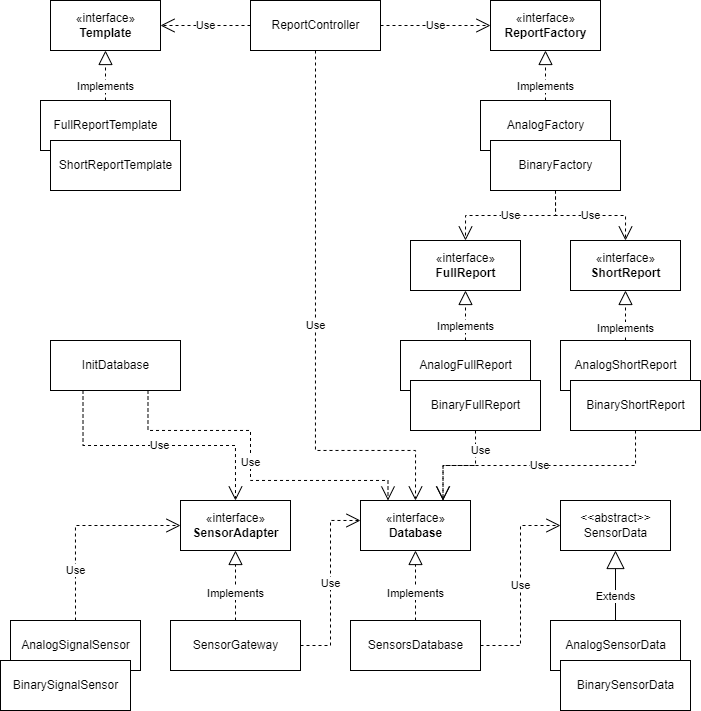

# softwareArchitecturePart7

## Диаграмма

----



## Описание решения

----

### Генерация данных

----

В системе работают два типа датчиков генерирующих аналоговый 
и бинарный сигналы (классы AnalogSignalSensor и BinarySignalSensor)  
Классы данных наследуются от абстрактного класса SensorData

```java
public abstract class SensorData {
    private final UUID Id;
    private final int sensorId;
    private final Date date;
    private SensorType sensorType;

    public SensorData(int sensorId, Date date) {
        this.Id = UUID.randomUUID();
        this.sensorId = sensorId;
        this.date = date;
    }

    public UUID getId() {
        return Id;
    }

    public int getSensorId() {
        return sensorId;
    }

    public Date getDate() {
        return date;
    }

    public SensorType getSensorType() {
        return sensorType;
    }

    protected void setSensorType(SensorType sensorType) {
        this.sensorType = sensorType;
    }

    @Override
    public String toString() {
        return "SensorData {" +
                " sensorId=" + sensorId +
                ", date=" + date +
                " }";
    }
}
```

Сгенерированные данные через интерфейс SensorAdapter 

```java
public interface SensorAdapter {
    boolean create(SensorData sensorData);
}
```

и его реализацию SensorGateway

```java
public class SensorGateway implements SensorAdapter {
    Database database;

    public SensorGateway(Database database) {
        this.database = database;
    }

    @Override
    public boolean create(SensorData sensorData) {
        return database.create(sensorData);
    }
}
```

заносятся в базу данных SensorsDatabase

### Интерактор? Генератор отчетов

----

Отчеты из базы данных генерируются при помощи абстрактной фабрики ReportFactory

```java
public interface ReportFactory {
    FullReport createFullReport();
    ShortReport createShortReport();
}
```

Генерируется четыре вида отчетов - по два (Full, Short) для каждого типа данных.  
Реализации - классы AnalogFullReport, AnalogShortReport, BinaryFullReport, BinaryShortReport

### Контроллер отчетов

----

**Сомнительная реализация(**

Использует два шаблона отчетов FullReportTemplate (данные со всех датчиков выбранного типа) 
и ShortReportTemplate (данные конкретного id датчика) 
для отображения полученных от фабрики данных

```java
public class ReportController {
    Database database = SensorsDatabase.getInstance();
    ReportFactory reportFactory;
    Template template;

    public void getFullReport(SensorType sensorType) {
        switch (sensorType) {
            case ANALOG -> reportFactory = new AnalogFactory();
            case BINARY -> reportFactory = new BinaryFactory();
        }
        template = new FullReportTemplate();
        template.showReport(reportFactory.createFullReport().getSensorData(database));
    }

    public void getShortReport(SensorType sensorType, int sensorId) {
        switch (sensorType) {
            case ANALOG -> reportFactory = new AnalogFactory();
            case BINARY -> reportFactory = new BinaryFactory();
        }
        template = new ShortReportTemplate();
        template.showReport(reportFactory.createShortReport().getSensorData(database, sensorId));
    }
}
```

### Инициализация

----

Для первоначального наполнения БД выполнен класс InitDatabase

```java
public class InitDatabase {
    Database database = SensorsDatabase.getInstance();
    SensorAdapter sensorAdapter = new SensorGateway(database);
    // Два типа датчиков
    AnalogSignalSensor analogSignalSensor = new AnalogSignalSensor(sensorAdapter);
    BinarySignalSensor binarySignalSensor = new BinarySignalSensor(sensorAdapter);

    public void setDatabase() {
        // Генерируем данные от датчиков
        for (int i = 0; i < 5; i++) {
            analogSignalSensor.getSensorData();
            binarySignalSensor.getSensorData();
        }
    }
}
```


